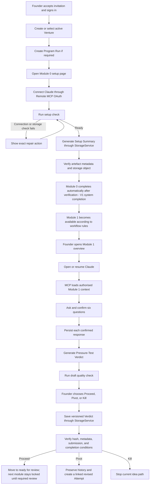
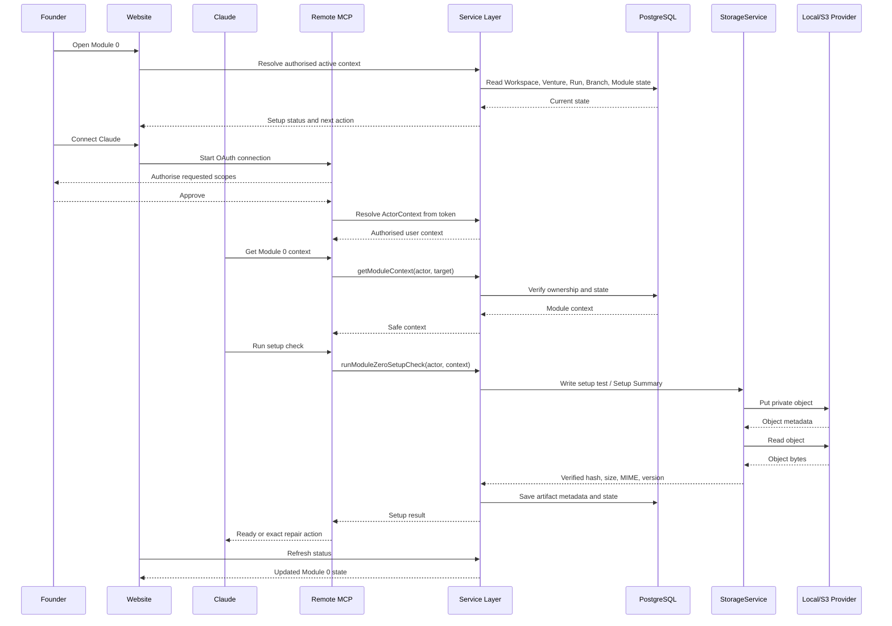
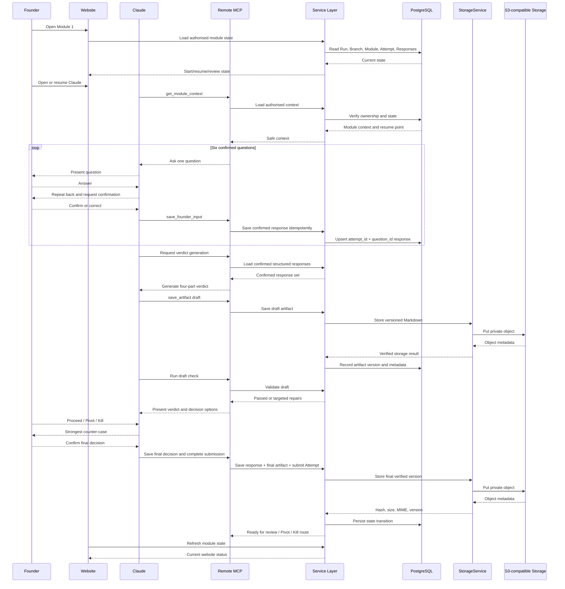

# Founder Toolkit V2 — Module 0 and Module 1 Workflow

**Document status:** Draft for product, UX, MCP, and engineering alignment  
**Version:** 1.2 — StorageService/S3 revision, plan-alignment fixes (2026-07-16)  
**Modules covered:** Module 0 — Setup and Connection; Module 1 — Pressure-Test My Idea

**Revision notes (1.2):**

- Canonical artefact filenames hyphenated: `Founder-Toolkit-Setup-Summary.md` and `Pressure-Test-Verdict.md`, matching the §22 object key convention.
- Module 0 completion rule made explicit for V1: system-completed on validation pass (`completion_mode = 'system'`); no Mentor review for Module 0.
- Founder decision persistence defined: `initial_decision`, `final_decision`, and `pivot_detail` are structured Responses (question keys 7–9) saved through `save_founder_input`; the strongest counter-case is recorded in the Verdict artefact and enforced by the draft check.
- V1 Pivot creates a linked revised Attempt (`based_on`) on the single main branch; new Branches/Forks are deferred beyond V1.

---

**Provenance note:** This is the tracked, canonical product specification. The seed script does not parse this file at runtime — database content is authored as TypeScript constants in `packages/services/src/content-seed/content/`, derived from this specification. If this document changes, those constants must be updated in a follow-up change; they are not kept in sync automatically.

---

## 1. Purpose

This document defines the end-to-end Founder experience and system behaviour for the first two Founder Toolkit modules.

It covers:

- what the Founder sees on the website;
- what happens in the connected AI client;
- how the Remote MCP server coordinates the workflow;
- how structured answers and artefacts are persisted;
- how module completion is verified;
- how progress, resume, retries, branching, and unlocking work.

This version removes Google Drive from the architecture. The platform owns artefact storage through `StorageService`:

- Local provider for development and automated tests;
- S3-compatible provider for Staging;
- S3 provider for Production.

The Founder connects the AI client once. The Founder does not connect a storage account, choose a bucket, manage folders, or download a separate Skill for every module.

---

## 2. Confirmed Operating Model

### 2.1 Core product principle

The Founder Toolkit website manages the journey. The connected AI client provides the conversational experience. Remote MCP connects the AI client to the platform's authorised business capabilities.

| Component | Responsibility |
|---|---|
| **Founder Toolkit website** | Login, Venture selection, setup guidance, module overview, progress, status, resume, review checkpoints, and module unlocking |
| **AI client** | Conversational workspace where the Founder completes module activities; V1 initially supports one Claude Remote MCP client |
| **Remote MCP server** | Authenticates the client, exposes controlled Tools/Resources/Prompts, loads module context, and calls the shared Service layer |
| **Service layer** | Enforces permissions, state transitions, idempotency, validation, artefact rules, and completion requirements |
| **Platform database** | Stores identity, Workspace/Venture ownership, Run/Branch/Module/Attempt state, confirmed responses, artefact metadata, decisions, and audit references |
| **StorageService** | Stores and retrieves artefact bytes through the configured Local or S3-compatible provider |
| **S3-compatible storage** | Durable private object storage for Staging and Production artefacts; not exposed directly to the AI client |

### 2.2 Dependency and trust boundary

```text
Founder
   │
   ├── Website ───────────────┐
   │                           │
   └── Claude + Remote MCP ───┼──> packages/services
                               │          │
                               │          ├──> packages/db ──> PostgreSQL
                               │          │
                               │          └──> StorageService
                               │                    │
                               │                    ├──> Local Provider
                               │                    └──> S3 Provider
                               │
                               └──> Audit logging
```

Important rules:

- MCP does not contain the business state machine.
- MCP does not directly write database rows.
- MCP does not receive S3 credentials.
- The AI client never selects raw object keys or bucket names.
- Web and MCP use the same Service methods.
- `user_active_contexts` is navigation state, not an authorisation source.
- Every Service call independently verifies Workspace, Venture, Run, Branch, Module, Attempt, and Artifact ownership.

### 2.3 Artefact source of truth

The durable artefact consists of two coordinated records:

1. **Database metadata**
   - Workspace, Venture, Run, Branch, Module, Attempt, and Artifact identifiers;
   - storage provider and controlled object key;
   - filename, MIME type, byte size, SHA-256, and version;
   - validation, submission, review, and completion state;
   - creation and update timestamps.

2. **Storage object**
   - the actual Markdown or other artefact content;
   - private by default;
   - accessed only through `StorageService`;
   - downloaded through short-lived signed URLs when required.

The database is the source of truth for business state and ownership. S3-compatible storage is the source of truth for persisted artefact bytes.

### 2.4 One-time client connection

The Founder connects Claude to the Remote MCP server once.

Later modules do not require:

- downloading another Skill;
- reconnecting storage;
- selecting an S3 location;
- copying a long system prompt;
- manually entering Workspace or Venture IDs;
- uploading the generated Markdown through the website.

The MCP server resolves the authorised active context and available module from platform state.

---

## 3. Combined Journey



---

# Module 0 — Setup and Connection

## 4. Module 0 Objective

Module 0 confirms that the Founder can use the Toolkit end to end before starting substantive work.

At completion, the system must know:

- the authenticated Founder;
- the authorised Workspace;
- the active Venture;
- the relevant Program Run and active Branch, if already created;
- the selected/supported AI client;
- whether OAuth and Remote MCP are working;
- whether MCP can read the current module context;
- whether `StorageService` can write, read, hash, and verify an artefact for the current Venture;
- whether the setup summary has been generated and stored successfully.

Module 0:

- does not connect Google Drive;
- does not ask startup pressure-test questions;
- does not produce a business verdict;
- does not ask the Founder to choose an S3 bucket or folder;
- does not expose infrastructure storage details to the Founder.

---

## 5. Module 0 Entry Conditions

The Founder can enter Module 0 when:

- the Founder is authenticated and active;
- the Founder owns or is authorised for a Workspace;
- an active, non-archived Venture exists;
- the relevant published Program Version is available;
- a Program Run exists or can be created under the configured workflow;
- Module 0 is `available`, `in_progress`, or resumable.

An archived Venture may be opened as history, but a new writable Run or Module 0 Attempt must not be started for it.

---

## 6. Module 0 Founder-Facing Website Flow

### Step 0.1 — Orientation

The website explains:

> AI is a thinking partner, not a substitute for speaking with customers. Toolkit recommendations are hypotheses until tested with real people and current evidence.

It also explains:

- the website manages status, progress, and review;
- the Founder completes the guided conversation in Claude;
- the platform securely stores generated artefacts;
- the Founder only needs to connect Claude once;
- no per-module Skill download is required.

**Primary action:** `Continue setup`

---

### Step 0.2 — Confirm Active Venture

Display:

- Workspace name;
- active Venture name;
- Venture status;
- Program Run status, if one exists;
- action to return to the Workspace page and select another Venture.

The Founder must not retype information already stored in the Venture record.

**Blocking conditions:**

- no active Venture;
- Venture does not belong to the Founder’s Workspace;
- Venture is archived;
- no published Program Version is available;
- the Founder is not authorised for the relevant Workspace.

---

### Step 0.3 — Connect Claude through Remote MCP

The website provides a one-time Remote MCP connection action.

The connection flow must:

1. use OAuth 2.1;
2. authenticate the Founder;
3. issue a token with the minimum required scopes;
4. bind the MCP client identity to the authenticated user;
5. verify issuer, audience, expiry, scope, and client ID on every request;
6. avoid putting a permanent Workspace ID in the token as an authorisation fact.

**Success state:** `Claude connected`

**Failure states:**

- OAuth cancelled;
- token expired;
- incorrect issuer or audience;
- missing scope;
- pending/deleted user;
- client connected to another account;
- MCP endpoint unavailable.

Each failure should show one specific recovery action.

---

### Step 0.4 — Run Setup Check

The Founder selects `Run setup check` from the website or starts Module 0 in Claude.

The system verifies:

1. authenticated Founder identity;
2. accessible Workspace;
3. active Venture;
4. Venture status permits writable work;
5. Program Run and active Branch context;
6. Module 0 availability;
7. Remote MCP connection;
8. ability to load Module 0 definition and prompt;
9. ability to call authorised read and write Tools;
10. ability of `StorageService` to write a small Markdown artefact;
11. ability to read the stored object back;
12. SHA-256, size, MIME type, and object metadata verification;
13. existing Setup Summary and resume state;
14. audit logging for success and failure.

Storage checks are executed by the platform. The Founder does not see bucket credentials, provider internals, or raw object keys.

---

### Step 0.5 — Generate Setup Summary

After checks pass, the system generates:

```text
Founder-Toolkit-Setup-Summary.md
```

Recommended content:

```markdown
# Founder Toolkit Setup Summary

## Founder Context
- Workspace:
- Venture:
- Program Run:
- Active Branch:

## Connection
- AI client:
- Remote MCP:
- OAuth status:
- Last checked at:

## Platform Storage
- Storage status:
- Artefact version:
- Verification status:
- Content SHA-256:

## Module Status
- Module 0:
- Next available module:

## Notes
- None
```

The summary is written through:

```text
MCP Tool
  → Module/Artifact Service
  → StorageService
  → Local or S3 Provider
```

The resulting database record stores controlled metadata. The AI client receives only the safe artefact result required for the workflow.

---

### Step 0.6 — Setup Result

#### Ready

Display:

- active Venture;
- Claude connection status;
- MCP health;
- platform storage health;
- Setup Summary status;
- last setup check time;
- Module 0 workflow state;
- next action.

#### Repair required

Display only the failed items and their repair action, for example:

- `Reconnect Claude`
- `Sign in with the correct account`
- `Retry MCP authorisation`
- `Restore the active Venture`
- `Retry platform storage check`
- `Contact support — storage provider unavailable`

The Founder should not repeat successful steps unnecessarily.

---

## 7. Module 0 System Sequence



---

## 8. Module 0 State Model

The exact database states remain governed by the shared Run/Module/Attempt state machines. The UI may present these simplified setup states:

| UI state | Meaning |
|---|---|
| `not_started` | Module 0 has not started |
| `connection_required` | Claude/MCP OAuth is not ready |
| `checking` | Setup check is running |
| `repair_required` | One or more checks failed |
| `ready_for_generation` | Connection and storage checks passed |
| `saving` | Setup Summary is being stored and verified |
| `completed` | Module 0 passed required validation and was completed automatically (V1: `completion_mode = 'system'`, no review queue) |
| `history` | Read-only state for an archived Venture or historical branch |

The UI must not invent a state transition that contradicts the canonical Service/database state machine.

**V1 completion rule:** Module 0 uses `completion_mode = 'system'`. Once required validation passes, the Module transitions to `completed` automatically and unlocks Module 1 according to the Program rules. Module 0 never enters the Mentor review queue; Mentor review applies from Module 1 onwards.

---

## 9. Module 0 Completion Criteria

Module 0 may advance only when:

- the Founder is authenticated;
- Workspace and Venture access are authorised;
- the Venture is writable;
- Remote MCP OAuth is valid;
- Module 0 context can be loaded;
- required MCP Tools can be called;
- the Setup Summary is stored through `StorageService`;
- the storage object is readable;
- hash, size, MIME type, and version metadata are verified;
- artefact and Attempt state are persisted;
- required draft/official validation rules pass;
- the Module is then completed automatically (V1: `completion_mode = 'system'`); no Mentor review is required for Module 0.

A successful chat message alone does not complete Module 0.

---

# Module 1 — Pressure-Test My Idea

## 10. Module 1 Objective

Module 1 helps the Founder test whether the current idea is clear and credible enough to continue.

The workflow must produce:

- six confirmed structured answers;
- five concrete reasons the business may fail;
- at least three named competitors, alternatives, or substitute behaviours;
- explicit conditions required for success;
- a Yes/No investor decision today;
- the single strongest reason for that decision;
- a Founder decision: Proceed, Pivot, or Kill;
- the strongest counter-case against the Founder’s initial decision;
- one verified, versioned `Pressure-Test-Verdict.md` artefact.

---

## 11. Module 1 Entry Conditions

Module 1 can start when:

- the Founder is authenticated and authorised;
- the active Venture is writable;
- the Program Run and active Branch exist;
- Module 0 has reached the prerequisite state defined by the Program Version;
- Module 1 is `available` or resumable;
- no conflicting in-progress Attempt exists;
- Claude/MCP connection is available.

The Module must be resumed rather than duplicated when a valid in-progress Attempt already exists.

---

## 12. Module 1 Website Flow

### Step 1.1 — Overview

Display:

- module title and purpose;
- expected output;
- estimated interaction style rather than a strict time promise;
- current state;
- active Venture and Branch;
- resume point, when applicable;
- final review requirement;
- primary action: `Open in Claude` or `Resume in Claude`.

The website does not provide the main six-question form in V1.

### Step 1.2 — Status and Resume

Possible Founder-facing states:

- not started;
- resume at question N;
- generating verdict;
- awaiting Founder decision;
- save/validation failed;
- ready for review;
- rejected and retry available;
- completed;
- historical branch.

The page reads current state from the shared Services. It does not infer completion from an S3 object alone.

---

## 13. Module 1 AI/MCP Flow

### Step 1A.1 — Load Authorised Context

Claude requests the current Module context through MCP.

The Service verifies:

- Actor identity and scopes;
- Workspace access;
- Venture ownership and status;
- Run and Branch ownership;
- Module availability;
- active Attempt;
- existing confirmed responses;
- existing artefact submissions;
- resume position.

MCP returns only the context needed to continue safely.

---

### Step 1A.2 — Evaluator Role

The AI acts as a rigorous evaluator, not a supportive copywriter.

It should:

- ask one question at a time;
- require concrete answers;
- challenge vague or contradictory statements;
- distinguish evidence from assumptions;
- preserve the Founder’s meaning;
- avoid fabricating traction, customers, competitors, or market evidence;
- repeat back each answer in one sentence;
- wait for confirmation before moving to the next question.

---

### Step 1A.3 — Six Confirmed Questions

Ask in this order:

1. **What is your idea in one sentence?**
2. **Who is your target customer? Describe them like a real person, not a segment.**
3. **What problem does this solve for that target customer?**
4. **How does this idea make money?**
5. **What is the idea's current stage — idea only, prototype, early users, or paying customers?**
6. **What alternatives or competitors do customers use today, including doing nothing?**

For every question:

1. ask the question;
2. receive the answer;
3. identify material ambiguity when necessary;
4. repeat the answer back in one sentence;
5. ask for confirmation;
6. persist only the confirmed version;
7. advance only after confirmation.

Confirmed responses are stored in PostgreSQL through `ResponseService`. They are not reconstructed only from the chat transcript.

---

### Step 1A.4 — Generate the Four-Part Verdict

#### Part 1 — Five reasons the business may fail

Requirements:

- exactly five substantive reasons;
- specific to the confirmed idea;
- no generic filler;
- each reason linked to a concrete assumption, dependency, or market risk.

#### Part 2 — Existing competitors and alternatives

Requirements:

- at least three named competitors, alternatives, or substitute behaviours;
- include “doing nothing” when relevant;
- separate verified current information from general model knowledge;
- do not invent unsupported claims.

#### Part 3 — Conditions required for success

Requirements:

- actionable and testable;
- connected to the failure risks;
- include measurable milestones or evidence where practical.

#### Part 4 — Investor decision today

Required format:

```text
Would an investor invest today? Yes / No

Single biggest reason:
...
```

The decision must reflect current evidence, not the theoretical maximum potential of the idea.

---

### Step 1A.5 — Draft Quality Check

The draft check verifies at minimum:

- all six responses exist and are confirmed;
- five concrete failure reasons exist;
- at least three named competitors/alternatives exist;
- success conditions are actionable;
- the investor decision is exactly Yes or No;
- one strongest reason is present;
- unsupported evidence is labelled;
- unresolved assumptions are separated;
- required Markdown sections exist.

Draft Check does not mark the Module complete.

When validation fails:

1. preserve confirmed responses;
2. identify the exact missing/weak section;
3. regenerate or repair only that section when possible;
4. submit a new version rather than overwriting accepted history.

---

### Step 1A.6 — Founder Decision

Present:

- Proceed;
- Pivot;
- Kill.

After the Founder chooses, present the strongest counter-case against that choice.

Then ask the Founder to confirm or revise the final decision.

Persist:

- initial decision — structured Response, `question_key = initial_decision` (`single_choice`: proceed / pivot / kill);
- final decision — structured Response, `question_key = final_decision` (`single_choice`: proceed / pivot / kill);
- Pivot detail, if applicable — structured Response, `question_key = pivot_detail` (`long_text`, `allow_skip = true`; required by the Service when `final_decision = pivot`);
- strongest counter-case — recorded in the Verdict artefact's dedicated section (AI-generated, not a question); the draft check verifies the section exists and is non-empty.

Decision Responses are saved through the same idempotent `save_founder_input` path as the six core questions (`attempt_id + question_id` upsert).

---

### Step 1A.7 — Save Final Artefact

The final Markdown is saved through:

```text
Claude
  → MCP save_artifact
  → ArtifactSubmissionService
  → StorageService
  → Local/S3 Provider
```

The Founder does not manually upload the file.

The system must:

1. validate the authorised Artifact Definition;
2. create the next artefact version;
3. generate a controlled object key;
4. write the Markdown as private content;
5. read or otherwise verify the stored content;
6. calculate and verify SHA-256;
7. record MIME type, size, provider, object key, and timestamps;
8. mark the prior version superseded when appropriate;
9. run required validation;
10. move the Attempt and Module only through valid state transitions;
11. record an independent MCP audit result.

---

## 14. Decision Routing

### Proceed

- preserve the completed Verdict;
- move the Attempt into the configured validation/review state;
- do not mark the Module completed solely because the Founder selected Proceed;
- do not unlock the next Module until the Program's required validation/review rule is satisfied.

### Pivot

- preserve the original responses and Verdict as immutable history;
- V1: create a linked revised Attempt (`based_on = previous_attempt_id`) on the single main branch; new Branches/Forks are deferred beyond V1;
- record the relationship to the previous work;
- do not silently copy previous responses as newly confirmed answers;
- keep the normal next Module locked until the revised path satisfies completion rules.

### Kill

- preserve all work as history;
- stop normal progression for the current idea path;
- do not unlock the next Module;
- allow the Founder to create another Venture or intentionally start an approved new path later.

---

## 15. Module 1 System Sequence



---

## 16. Module 1 State Model

Canonical status remains controlled by the database and Services.

A simplified workflow view:

```text
locked
  ↓
available
  ↓
in_progress
  ↓
submitted
  ↓
ready_for_review
  ├── accepted → completed → next module available
  └── rejected → retry attempt → in_progress
```

Additional conversational checkpoints may include:

- awaiting answer confirmation;
- generating verdict;
- draft quality review;
- awaiting Founder decision;
- saving;
- storage repair required.

These checkpoints must not bypass canonical state transitions.

---

## 17. Pressure-Test Verdict Template

```markdown
# Pressure-Test Verdict

## Venture
- Venture name:
- Run:
- Branch:
- Attempt:
- Completed at:

## Confirmed Q&A

### 1. Idea in one sentence

### 2. Target customer

### 3. Customer problem

### 4. Business model

### 5. Current stage

### 6. Competitors, alternatives, and doing nothing

## Four-Part Verdict

### 1. Five reasons this business may fail

1.
2.
3.
4.
5.

### 2. Existing competitors and alternatives

1.
2.
3.

**Evidence note:**

### 3. Conditions required for success

### 4. Would an investor invest today?

**Decision:** Yes / No

**Single biggest reason:**

## Founder's Decision

### Initial decision

Proceed / Pivot / Kill

### Strongest counter-case

### Final confirmed decision

### Pivot detail, if applicable

## Working Notes / Unresolved Assumptions

- None
```

---

## 18. Module 1 Completion Criteria

Module 1 reaches the submission/review stage only when:

- all six answers are confirmed;
- confirmed answers are stored as structured Responses;
- the four-part verdict is complete;
- the draft quality check passes;
- the Founder makes and confirms a Proceed/Pivot/Kill decision;
- the strongest counter-case is recorded;
- unsupported claims and unresolved assumptions are labelled;
- one final versioned `Pressure-Test-Verdict.md` is stored through `StorageService`;
- the storage object is private and readable by the authorised service;
- SHA-256, size, MIME type, provider, and version metadata are recorded;
- the Attempt is submitted through the valid Service state transition;
- required official validation is performed by an authorised source;
- the Module enters the configured review state.

Module completion and next-module unlocking occur only after the required review/acceptance rule. A saved S3 object or successful chat response alone is insufficient.

---

## 19. Resume and Idempotency Rules

### Module 0

- repeated setup checks must not create duplicate Setup Summaries;
- storage tests must use controlled temporary or versioned objects;
- successful checks should not be repeated unnecessarily;
- a failed check must not erase prior successful state;
- repeated completion requests return the existing result;
- no raw S3 credentials or object keys are supplied by the Founder.

### Module 1

- resume at the first incomplete or unconfirmed step;
- do not ask confirmed questions again unless the Founder chooses to revise;
- `save_founder_input` is idempotent for the same Attempt and Question;
- repeated `save_artifact` calls must not create uncontrolled duplicate versions;
- repeated submit/complete requests return the current result;
- submitted, rejected, accepted, or superseded history is immutable;
- Pivot creates an explicitly linked revised Attempt (V1: same main branch, `based_on` set);
- a storage write success followed by a callback failure can be reconciled by hash/version/idempotency key.

Suggested idempotency inputs:

- `attempt_id + question_id`;
- `artifact_submission_id`;
- `tool_call_id`;
- JSON-RPC request ID;
- explicit idempotency key;
- content SHA-256.

---

## 20. Error Handling

| Failure | Expected behaviour |
|---|---|
| MCP connection unavailable | Preserve platform progress and show a reconnect action |
| OAuth token invalid or expired | Return 401 with correct authentication metadata; request reconnection |
| User connected with the wrong account | Reject context loading and expose no Venture data |
| Venture belongs to another Workspace | Return NOT_FOUND/FORBIDDEN according to the Service contract; never rely on active context |
| Venture becomes archived | Prevent new writable progression and allow read-only history |
| Storage provider unavailable | Preserve structured responses; keep the Attempt non-complete; retry only the storage step |
| Storage write times out | Reconcile using idempotency key and object metadata before attempting another version |
| Hash or MIME verification fails | Mark the artefact unverified; do not advance the Attempt |
| Object exists but database callback failed | Reconcile the controlled object key/hash and complete idempotently |
| Database metadata exists but object is missing | Mark storage repair required; do not report completion |
| Artefact version already submitted | Return current immutable submission state |
| Draft validation fails | Preserve confirmed responses and repair only the failed sections |
| Founder leaves mid-question | Resume at the same unconfirmed question |
| Website displays stale state | Refresh from the Service; do not rerun the workflow |
| Current-source research is unavailable | Label findings as incomplete/general knowledge; do not fabricate evidence |

---

## 21. MCP Capability Boundary

Suggested V1 capabilities:

| MCP capability | Service responsibility |
|---|---|
| `get_active_context` | Resolve safe navigation context; never treat it as authorisation |
| `list_modules` | Return authorised modules and canonical status |
| `get_module_status` | Return current Run/Branch/Module/Attempt state |
| `get_module_context` | Load authorised definition, prompt, questions, confirmed Responses, resume point, and artefact metadata |
| `save_founder_input` | Validate and persist confirmed structured Responses idempotently |
| `get_artifact` | Read an authorised artefact through `StorageService` |
| `save_artifact` | Validate Artifact Definition, store content, verify metadata, and create a versioned submission |
| `complete_module` | Check completion requirements and request only the state transition the Actor is permitted to perform |

Restrictions:

- MCP cannot directly query or mutate business tables.
- MCP cannot request arbitrary S3 object keys.
- MCP cannot receive permanent S3 credentials.
- MCP/Founder cannot trigger Mentor-only acceptance.
- MCP cannot trigger Official Validation unless the explicit permission matrix later allows a safe system path.
- Failed and unauthorised Tool calls must still produce audit records.
- Audit metadata must not duplicate full Founder responses or artefact content.

---

## 22. Storage Object Strategy

Example controlled object key:

```text
workspaces/{workspaceId}/
  ventures/{ventureId}/
    runs/{runId}/
      branches/{branchId}/
        modules/{moduleId}/
          artifacts/{artifactDefinitionId}/
            submissions/{submissionId}/Pressure-Test-Verdict.md
```

Rules:

- all buckets are private;
- Staging and Production use separate buckets and credentials;
- object keys are generated by the Service, not the client;
- signed URLs are short-lived;
- MIME type is verified server-side;
- size limits are enforced;
- SHA-256 is calculated server-side or independently verified;
- arbitrary object deletion is not exposed;
- unverified objects cannot become official submissions;
- historical accepted/superseded versions are retained according to policy;
- Local provider mirrors the same logical key structure for development.

---

## 23. MVP UX Requirements

### Required in MVP

- Founder invitation and login;
- active Venture selection;
- one-time Claude Remote MCP connection;
- setup health/status page;
- Module 0 setup check;
- platform storage health display without exposing S3 details;
- Module 0/1 overview pages;
- `Open in Claude` / resume action;
- progress and canonical status;
- final artefact availability through a controlled download/view action;
- Proceed/Pivot/Kill result display;
- validation/review status;
- clear retry and repair actions.

### Not required in the first MVP UI

- Google Drive connection;
- storage provider selection;
- S3 bucket or folder selection;
- browser file upload for AI-generated Markdown;
- fully embedded website chat;
- editing the full artefact inside the website;
- separate per-module Skill installation;
- separate Claude and Codex onboarding;
- Mentor review UI before the Mentor iteration;
- presentation or investor-deck generation.

---

## 24. Acceptance Scenarios

### Scenario A — First-time Founder

1. Founder signs in.
2. Founder creates or selects an active Venture.
3. Founder opens Module 0.
4. Founder connects Claude through Remote MCP OAuth.
5. Setup check verifies context, Tool access, database state, and StorageService.
6. Setup Summary is stored and verified.
7. Module 0 reaches its configured review/completion state.
8. Module 1 becomes available according to the Program rules.
9. Founder completes six confirmed answers in Claude.
10. Verdict and decision are saved as a versioned artefact.
11. Draft and official validation follow the permission matrix.
12. Website displays the correct review and next-route state.

### Scenario B — Returning Founder

1. Founder leaves during question 4.
2. The first three confirmed Responses remain in PostgreSQL.
3. Claude reconnects and MCP loads the active Attempt.
4. The workflow resumes at question 4.
5. No duplicate Attempt or artefact is created.

### Scenario C — S3 write failure

1. Founder completes the six questions and verdict.
2. Structured Responses are saved successfully.
3. StorageService cannot write the final artefact.
4. The Attempt remains incomplete/non-submitted.
5. The website shows `Storage repair required`.
6. After storage recovery, the system retries only the final write, verification, and submission steps.
7. Idempotency checks prevent duplicate versions.

### Scenario D — Storage callback failure after successful write

1. S3 stores the object.
2. The database callback or MCP response fails.
3. The same request is retried with the same idempotency key.
4. The Service discovers the existing controlled object/version.
5. Metadata is reconciled without writing a duplicate object.
6. The workflow continues from the verified state.

### Scenario E — Pivot

1. Founder chooses Pivot.
2. The original Responses and Verdict remain read-only history.
3. A linked revised Attempt (`based_on`) is created on the same main branch.
4. Previous answers are visible as reference but not automatically reconfirmed.
5. The normal next Module remains locked until the revised path satisfies completion rules.

### Scenario F — Archived Venture history

1. A Venture is archived.
2. Existing Module artefacts remain available through authorised read-only access.
3. The Founder may select the archived Venture as UI history context.
4. A new Run or writable Attempt cannot be created for it.

### Scenario G — Cross-Workspace attack

1. A client supplies another Workspace’s Venture, Run, Module, or Artifact ID.
2. The MCP handler forwards the request to the Service without trusting active context.
3. The Service rejects access.
4. No S3 object or metadata is returned.
5. The failed call is recorded in the MCP audit log.

---

## 25. Final Product Rule

The first two modules should prove this loop:

> **Website guidance → one connected Claude workspace → authorised MCP workflow → structured confirmed data → one versioned S3-backed artefact → verified submission → controlled review and unlock.**

The Founder should experience S3 as reliable platform storage, not as a storage product they must configure.

Every implementation decision should make the loop:

- easier to start;
- safer to authorise;
- resumable after failure;
- idempotent under MCP retries;
- consistent between Web and MCP;
- independent of manual file handling;
- auditable without storing unnecessary conversation content.
